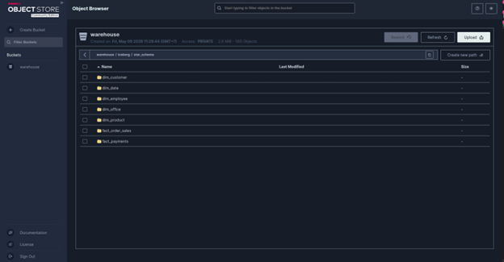
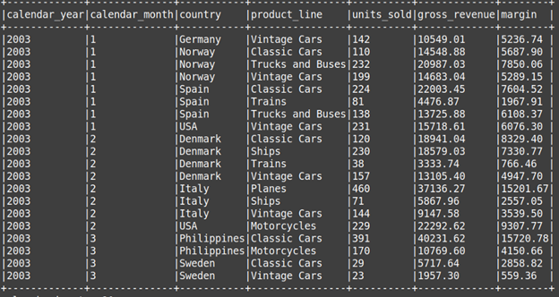

# Classicmodels MySQL to Iceberg Star Schema

```text
MySQL classicmodels
  -> Spark ETL định kỳ
  -> Iceberg bronze tables trên MinIO
  -> Iceberg star schema tables trên MinIO
```

Stack gồm:

- `mysql`: source RDBMS, seed database `classicmodels`.
- `minio`: object storage để lưu Iceberg warehouse.
- `create-bucket`: tạo bucket `warehouse` trong MinIO.
- `etl`: chạy một lượt ETL.
- `sync`: chạy ETL định kỳ, mặc định mỗi 300 giây.
- `query`: chạy query

## Đồng bộ

Chạy service sync: `docker compose --profile scheduler up sync`

## Bronze Layer

Bronze là lớp Iceberg lưu dữ liệu gần giống source nhất. ETL đọc toàn bộ từng bảng MySQL, tính `_row_hash` cho mỗi dòng, rồi đồng bộ vào Iceberg theo primary key.

Bronze tables:

- `local.bronze.offices`
- `local.bronze.employees`
- `local.bronze.customers`
- `local.bronze.productlines`
- `local.bronze.products`
- `local.bronze.orders`
- `local.bronze.orderdetails`
- `local.bronze.payments`

Mỗi bảng bronze có thêm metadata:

- `_row_hash`: phát hiện update.
- `_is_deleted`: đánh dấu dòng đã bị xóa ở source.
- `_synced_at`: thời điểm sync gần nhất.

## Star Schema

Star schema được build từ các bronze rows còn active:

- `local.star_schema.dim_customer`
- `local.star_schema.dim_product`
- `local.star_schema.dim_employee`
- `local.star_schema.dim_office`
- `local.star_schema.dim_date`
- `local.star_schema.fact_order_sales`
- `local.star_schema.fact_payments`

Các measure chính:

- `quantity_ordered`
- `price_each`
- `gross_sales_amount`
- `cost_amount`
- `margin_amount`

## Pipeline ETL (Python + Spark) và sync

`build_star_schema.py`: Orchestrator chính, gọi `sync_all_bronze()` rồi `build_star_schema()`.

`common.py`: Shared utilities - `env()`, `get_spark_session()`, `key_expr()`, `nullable_key_expr()`, `table_name()`, `q()`, `create_namespace()`, `table_exists()`, `with_sync_metadata()`.

`bronze.py`: Đồng bộ các bảng nguồn MySQL vào Iceberg bronze tables trên MinIO. Đọc source qua JDBC, so sánh với bronze bằng primary key và `_row_hash`, rồi `MERGE INTO` Iceberg để insert/update/mark deleted rows.

`star_schema.py`: Chuyển dữ liệu từ mô hình OLTP sang Star Schema. Ghi các bảng dimension và fact vào Iceberg warehouse trên MinIO.

`query_star_schema.py`: Dùng Spark SQL kết nối đến Iceberg catalog. Đọc các bảng Star Schema từ MinIO. Chạy các truy vấn kiểm tra.

`sync` service trong `docker-compose.yml`: Chạy lại `build_star_schema.py` theo chu kỳ. Mỗi lần chạy, pipeline đọc lại source MySQL, so sánh với bronze bằng primary key và `_row_hash`, sau đó `MERGE INTO` Iceberg để insert/update/mark deleted rows.

## Kết quả query





